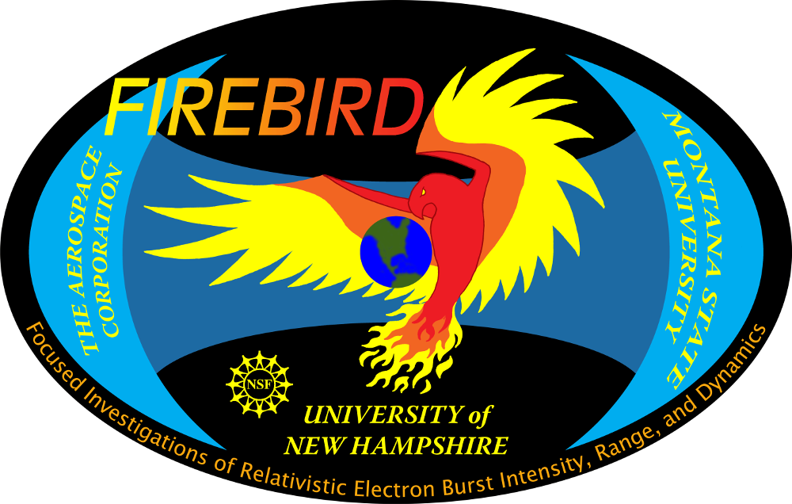
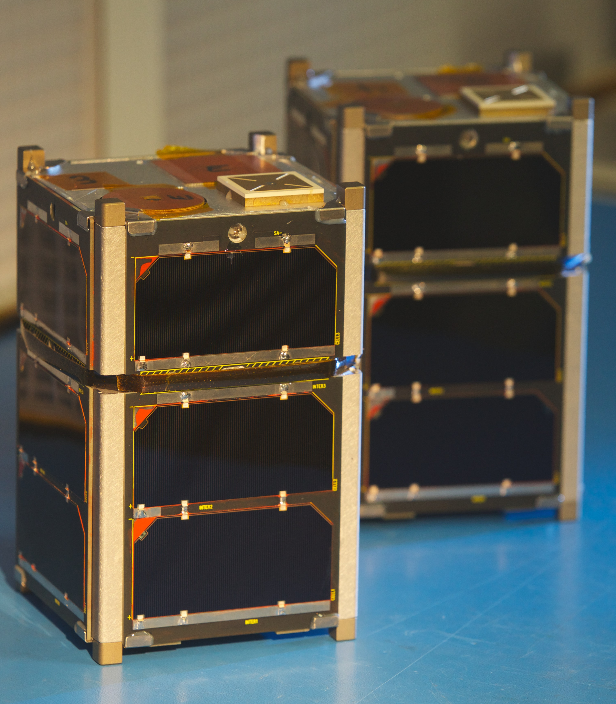
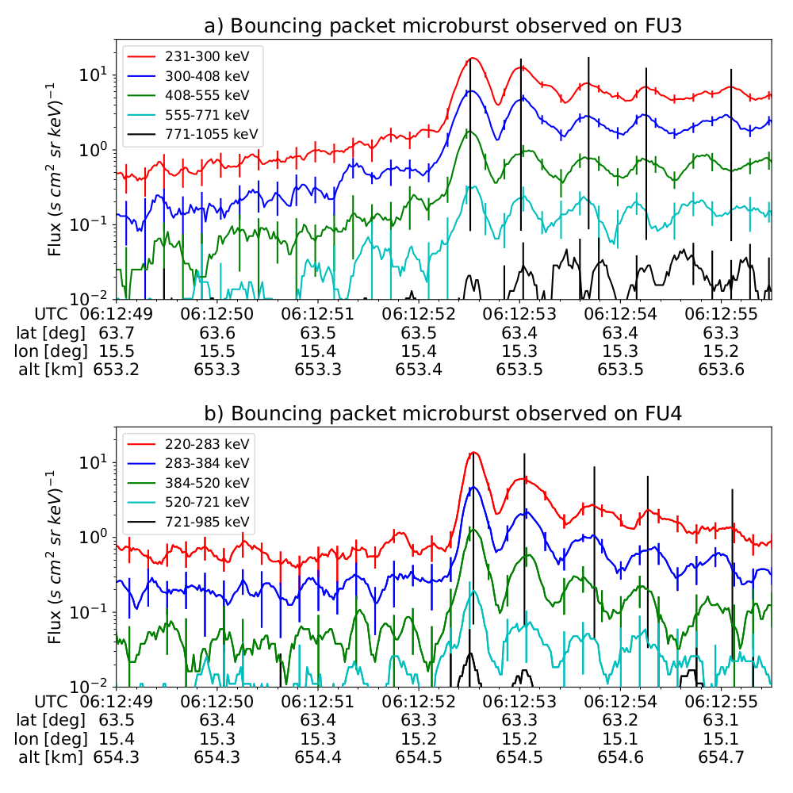
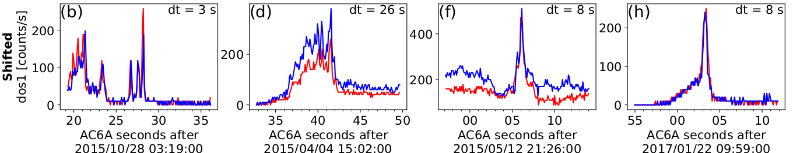
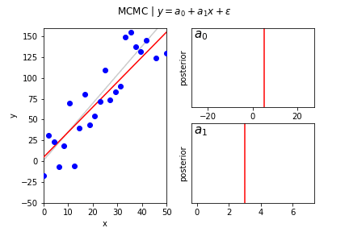

I study energetic particle precipitation from space into Earth's atmosphere using multi-spacecraft missions. With multiple measurements made nearby, it is possible to study a variety of transient and persistent energetic particle precipitation phenomena---that is impossible to understand from a single spacecraft. My PhD research focused on a type of transient electron precipitation into the atmosphere called microbursts, a sub-second intense impulse of electrons observed in low Earth orbit, upper atmosphere, and recently in the heart of the radiation belts. Microbursts have been estimated to deplete the outer radiation belt electrons as quickly as a few hours and affect atmospheric chemistry. My work on microbursts is highlighted in the [Publications](/publications/) section.

During my graduate career I had the privilege to operate the pair of FIREBIRD-II CubeSats for over five years. FIREBIRD-II was launched on January 31st, 2015 and are operational to this day. They are equipped with silicon solid state detectors that are sensitive to electrons in the range of 200 - 1000 kilo electron Volts (keV). The primary FIREBIRD-II science is to determine the spatial size and energy spectra of energetic electron microbursts shown below.

***The twin FIREBIRD-II CubeSats on the bench before launch, and examples of a microburst observed simultaneously by FIREBIRD-II where subsequent bounces were observed. More bouncing microburst details are [here](/publication/bouncing_packet_paper_1).***

## Current Projects
For my postdoctoral research, I am studying a form of stationary and persistent precipitation called curtains. Curtains were recently discovered and little is known about them; curtains can persist for at least 65 seconds, and they are very small. So small, in fact, that a spacecraft will typically cross one in about a second, roughly ten kilometers in low Earth orbit. My goal is to answer two questions: what are curtains, and what is their impact on atmospheric chemistry such as ozone? 

***Four examples of electron curtain precipitation observed by AC6 unit A in red and unit B in blue. Unit B's time series data was shifted by dt to show the electron precipitation observed at the same location.***

I am also working with the GTOsat science team to define the particle and wave data products and create a data pipeline to automatically process data and make it immediately available to the scientific community

## Research Interests
Besides analyzing time series data to study microbursts and curtain precipitation, I develop models to link data to reality---or our best understanding of reality---to understand how the modeled reality is measured by our imperfect instruments. Two data analysis tools that I'm learning are: Artificial Neural Networks and Bayesian inference. Bayesian inference allows a modeler to explicitly incorporate statistical and systematic uncertainty into model to make statistically-guided inferences about results. 

***Example animation of Bayesian linear regression using the Metropoplis Markov Chain Monte Carlo (MCMC) sampler. Red lines show the "true" line and blue dots are the observations from the "true" line assuming Gaussian noise. Each frame shows an iteration of the MCMC, and the final frame shows the final posteror histogram.***
