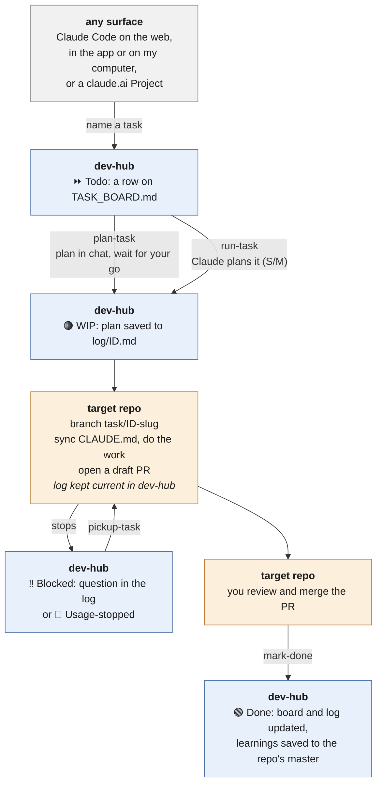

I have a handful of research and side-project repos that all need the same kind of upkeep:
tests that were never written, dated packaging, automated checks (continuous integration, or CI)
that don't exist, outdated READMEs. None of it is hard, but it never makes it to the top of the
list; *a lot of development stops once things work, as in plenty of research codebases*.

This is why I built `dev-hub`, a small private GitHub repo that acts as mission control for
Claude to operate and work on small tasks across GitHub repos.
{: .notice--primary}

`dev-hub` holds no code. It holds a **task board** listing a set of tasks for every repo I
track, a **playbook** of rules every Claude session follows to complete tasks and integrate
changes into the GitHub repos, and a **record** of what each task did. I name a task, Claude
works it on a branch, and I get back a pull request to review. My own dev-hub is private, but
there's a generic copy, [**dev-hub-template**](https://github.com/kylermurphy/dev-hub-template)
(MIT), that you can fill in with your own repos.

The first half of this post gets you started and covers the key pieces. Everything under
*Going further* is optional reading and dives deeper into how `dev-hub` works.



## Try it

Getting started takes four steps:

1. Create a **private** repo from
   [dev-hub-template](https://github.com/kylermurphy/dev-hub-template). It holds your plans and
   tasks, so keeping it private is a good idea, though not necessary.
2. Open it in Claude Code, or in [claude.ai/code](https://claude.ai/code) with the repo
   attached, and run `add-repo <owner>/<repo>` for each project you want tracked.
   - **Using claude.ai/code or a Claude Project?** Connect GitHub in claude.ai
     (**Settings → Connectors**) and install the
     [Claude GitHub App](https://github.com/apps/claude) on GitHub. Installing it on all your
     repos is easiest, but you can select only the ones you add to `dev-hub`.
3. Run `refresh-overview`, then `scan-repo <name>` to get a first task table for that repo.
4. Pick a small (**S**) task and run `run-task <ID>`: Claude plans it and carries on. Or run
   `plan-task <ID>` to agree on a plan with Claude first.

A first session with one of my repos looked like this:

```
add-repo kylermurphy/gmag   # track the repo; it gets the prefix GMAG-
scan-repo gmag              # Claude proposes GMAG-1 … GMAG-5; I merge the board PR
plan-task GMAG-1            # Claude proposes a plan and waits for my go; then work starts
                            # Claude opens a gmag PR; I review and merge it
mark-done GMAG-1            # mark it done on the task board, log finalized, learnings saved
```

The template's
[`examples/`](https://github.com/kylermurphy/dev-hub-template/tree/main/examples) folder walks
through the same steps on an imaginary repo, from an empty board to a finished task.

## How it works

### GitHub is the hub

Claude can work on code in a few places: [Claude Code](https://code.claude.com) on my machine,
Claude Code on the web or app (good for running from a mobile device), or a claude.ai Project
(good if you don't have access to Claude Code). These can't see each other, and a chat's
context is gone once it ends. **GitHub is the one thing they can all reach**, so all state
lives there. Any session can pick up any task from its board row and log alone.



Each box says where the step happens: grey is wherever I'm working, blue is dev-hub (the board,
the log and the repo's instructions), and orange is the target repo (the branch and the PR).
Both repos live on GitHub.

### What's in the repo

Everything is plain markdown:

| File | What it is |
| --- | --- |
| `TASK_BOARD.md` | The backlog: tracked repos, an overview of each, and one task table per repo. |
| `FEATURE_BOARD.md` | Larger work that stays on one branch until it's finished, grouped by repo ([more on features](https://kylermurphy.github.io/posts/2026/09/post-12/)). |
| `CLAUDE.md` | The rules for Claude, including the full **task protocol**. |
| `COMMANDS.md` | The spec for every command. |
| `TASK_LOG.md` + `log/` | An index of tasks and features, plus one write-up for each: plan, next step, what was done, how it was tested. |
| `repos/<name>/CLAUDE.md` | A **master** instruction file per project: how to build and test it, and what earlier tasks learned (a bit of memory for the agents). |
| `projects/` | One file per multi-month research project, a layer above the boards ([more on projects](https://kylermurphy.github.io/posts/2026/10/post-13/)). |

### Plan → Launch → Track → Land

Every task, and every feature, follows the same loop:

- **Plan.** `scan-repo` sets each task's definition of done. `plan-task` then drafts a fuller
  plan with me and **waits for my go**; `run-task` has Claude plan a small task itself and carry
  on. Either way, the plan is saved to the log before any heavy work.
- **Launch.** Claude works the task on its own branch (`task/<ID>-<slug>`) in the target repo.
  It never commits to `main`. Naming a task ID on its own, like "do GMAG-2", means `run-task`.
- **Track.** The first commit copies the repo's master `CLAUDE.md` in from dev-hub. Every step
  after that is logged, so a stopped task can resume where it left off.
- **Land.** Claude opens a draft PR. I review and merge it, and `mark-done` closes the task on
  the board in the `dev-hub` repo.

  `mark-done` also saves anything the task learned (a build quirk, a gotcha) into the repo's
  master `CLAUDE.md`. That's dev-hub's light version of a memory bank: the next task in that
  repo reads it before it starts. More in [Memory](#memory).

The **definition of done** is written on the task's board row before work starts, so
"finished" is never a judgment call made at the end. A task's status is one of ⏩ `Todo`, 🟠 `WIP`,
‼️ `Blocked` (waiting on a decision from me), 🛑 `Usage-stopped` (paused by usage limits) or
🟢 `Done`, and the board shows the icon with the word.
Only `mark-done` sets `Done`, and only after checking that the PR merged.

## The commands

Commands are just words typed into a Claude session. There are three groups.

**Board maintenance** keeps the boards current. Each run is a branch and a PR in dev-hub,
with no task log.

| Command | What it does |
| --- | --- |
| `add-repo <repo>` | Adds a repo to the board and gives it a task-ID prefix (`gmag` → `GMAG-`). |
| `refresh-overview` | Rewrites the overview table: commits, last activity, stack, state. |
| `scan-repo <name>` | Reads a repo's README, tests, CI and TODOs; proposes tasks; writes its master `CLAUDE.md`. |
| `new-task <repo>` | Adds a task I describe, with the next free ID and a definition of done. |
| `new-feature <repo>` | Adds a feature I describe, with a description and proposed subtasks. |
| `check-board` | Checks that IDs are unique and the boards, logs and projects agree. It's a script, and it also runs in CI on every PR. |

**Task lifecycle** commands run the loop above, for tasks and features.

| Command | What it does |
| --- | --- |
| `plan-task <ID>` | Drafts the plan with me and waits for my go, then saves it to the log, sets `WIP` and does the work. |
| `run-task <ID>` | Claude plans a small task itself, saves the plan and works it through to a draft PR, stopping only to ask when it must. |
| `multi-task <ID> <ID> …` | Runs up to five small tasks from one repo on one branch and one PR. |
| `pickup-task <ID>` | Resumes a stopped task from its log, or works a feature's next subtask. |
| `mark-done <ID>` | After the merge: sets `Done`, finalizes the log, saves learnings. |

**Projects** work on the research layer above the boards ([more on projects](https://kylermurphy.github.io/posts/2026/10/post-13/)).

| Command | What it does |
| --- | --- |
| `new-project "<title>"` | Starts a research project file from the template. |
| `plan-project <ID>` | Drafts a research plan with me and waits for my go. |
| `review-projects` | A monthly check-in that flags stale projects and overdue work. |

Put `plan` in front of any command (`plan scan-repo gmag`, `plan GMAG-2`) for a dry run.
Claude does the read-only part and proposes the changes. Nothing is committed until I say "go".

## The task board

Here's a trimmed copy of my live board, showing just the `gmag` and `smurphs_cooking` repos.
Each `Done` task links to its merged PR so you can follow the trail.

<div class="notice--info" markdown="1">

### Tracked Repos
{: .no_toc}

| Repo | URL | Visibility | Prefix | Tracking | Notes |
| --- | --- | --- | --- | --- | --- |
| gmag | https://github.com/kylermurphy/gmag | public | `GMAG-` | active | Legacy setup.py |
| smurphs_cooking | https://github.com/kylermurphy/smurphs_cooking | public | `COOK-` | active | Jekyll recipe site (GitHub Pages) + build.py |

### Repo overview
{: .no_toc}

| Repo | Purpose | Commits | Last active | Stack | State |
| --- | --- | --- | --- | --- | --- |
| gmag | Ground-magnetometer data I/O (CARISMA, IMAGE, THEMIS) | 210 | Oct 2025 | Python | Mature · no tests · no CI · setup.py |
| smurphs_cooking | Personal Jekyll recipe site (GitHub Pages) with search, tags, serving scaling | 16 | Aug 2026 | Jekyll + JS (legacy Python `build.py`) | Live · no CI · no Gemfile · template README |

### gmag — `GMAG-`
{: .no_toc}

| ID | Status | Task | Type | Effort | Definition of done |
| --- | --- | --- | --- | --- | --- |
| [GMAG-1](https://github.com/kylermurphy/gmag/pull/7) | 🟢 Done | Migrate `setup.py` → `pyproject.toml` and bump status past Alpha | Packaging | S | Modern build metadata; `pip install -e .` still works |
| GMAG-2 | ⏩ Todo | Add GitHub Actions CI (import + lint) on Python 3.10–3.12 | CI | S | Workflow runs green on push/PR across the matrix |
| GMAG-3 | ⏩ Todo | Add a test suite for the loaders (mock the HTTP fetch) | Testing | M | `carisma`/`image`/`themis` loaders covered without hitting the network |
| GMAG-4 | ⏩ Todo | Replace the `wget` dependency with `requests` streaming | Refactor | S | `wget` dropped from install_requires; downloads still work |
| GMAG-5 | ⏩ Todo | Confirm the `efield` module is implemented, tested, and documented | Feature | M | efield derivation covered by a test and a README/example |

### smurphs_cooking — `COOK-`
{: .no_toc}

| ID | Status | Task | Type | Effort | Definition of done |
| --- | --- | --- | --- | --- | --- |
| [COOK-1](https://github.com/kylermurphy/smurphs_cooking/pull/2) | 🟢 Done | Stop publishing non-site files: add `build.py`, `templates/`, `unparsed.md` to `_config.yml` `exclude` | Hygiene | S | Built `_site/` contains none of those files; recipe pages unchanged |
| COOK-2 | ⏩ Todo | Decide on one build path: remove the unused Jinja `build.py` + `templates/` or document why they stay | Refactor | S | Only one generator remains, or README explains the second; nothing references a missing `requirements.txt` |
| COOK-3 | ⏩ Todo | Add a `Gemfile` (`github-pages` gem) so the site builds locally | Build | S | `bundle install && bundle exec jekyll build` succeeds from a clean clone; README uses it |
| COOK-4 | ⏩ Todo | Add GitHub Actions CI: Jekyll build + front-matter check on `_recipes/*.md` | CI | M | Workflow runs on push/PR; fails if the build breaks or a recipe lacks `title`/`date` |
| COOK-5 | ⏩ Todo | Rewrite the README for this site | Docs | S | README describes this repo's real setup, front-matter keys, and import workflow |
| [COOK-6](https://github.com/kylermurphy/smurphs_cooking/pull/1) | 🟢 Done | Normalize tags to lowercase | Content | S | Every tag in `_recipes/` is lowercase; tags page shows no case-duplicate groups |
| COOK-7 | ⏩ Todo | Convert `unparsed.md` (Thai Chicken Pad See Ew) into a `_recipes/` entry and delete it | Content | S | New recipe page renders with ingredients/instructions; `unparsed.md` removed |
| [COOK-8](https://github.com/kylermurphy/smurphs_cooking/pull/3) | 🟢 Done | Fix slug typos (`egg-roll-ramnen`, `cheesey-taco-rice`) without breaking old links | Content | S | Files renamed; old URLs redirect (e.g. `jekyll-redirect-from`) or the change is deliberately skipped with a note |

</div>

### Reading the board

- **Tracked Repos is the input.** It's the only table I edit (through `add-repo`). Its
  **Prefix** column is where task IDs come from, and setting **Tracking** to `paused` shelves a
  repo.
- **Repo overview is derived.** `refresh-overview` regenerates it, so I never edit it. The
  **State** column is a quick health check: gmag has no tests and no CI, which is why GMAG-2
  and GMAG-3 exist.
- **Each task has a definition of done and an effort size.** Effort (S / M / L) decides which
  model runs the task and whether it can run unattended.
- **Status is the only column that changes as work happens,** and only the commands change it.

`TASK_LOG.md` keeps a running index of every task that's been started, newest first:

| Date | Task | Repo | Branch | PR / patch | Status |
| --- | --- | --- | --- | --- | --- |
| 2026-09-25 | GMAG-1 | gmag | `task/GMAG-1-pyproject` | [gmag#7](https://github.com/kylermurphy/gmag/pull/7) | Done (merged 2026-09-25) |
| 2026-09-25 | COOK-8 | smurphs_cooking | `task/COOK-8-fix-slug-typos` | [smurphs_cooking#3](https://github.com/kylermurphy/smurphs_cooking/pull/3) (from handed-back patch) | Done (PR confirmed 2026-09-25) |
| 2026-09-23 | COOK-1 | smurphs_cooking | `task/COOK-1-exclude-nonsite-files` | [smurphs_cooking#2](https://github.com/kylermurphy/smurphs_cooking/pull/2) | Done (merged 2026-09-24) |
| 2026-09-23 | COOK-6 | smurphs_cooking | `task/COOK-6-lowercase-tags` | [smurphs_cooking#1](https://github.com/kylermurphy/smurphs_cooking/pull/1) | Done (merged 2026-09-23) |

## Where it runs

The workflow is documented for several surfaces, but I've only run real tasks through the
first three. The claude.ai Project handback surface is particularly useful if you don't have
Claude Code. It provides Git-formatted commit patches and zips of the changed files, since a
Project can't push. The workflow is a bit more user intensive, but not by much. You can read
more about it [here](https://kylermurphy.github.io/posts/2026/09/post-11/).

| Surface | Status | Good for |
| --- | --- | --- |
| Claude Code on the web or in the Claude app ([claude.ai/code](https://claude.ai/code)) | Verified | Most tasks. A cloud session with the target repo and dev-hub attached clones, builds, tests, pushes and opens PRs. |
| Claude Code on my machine | Verified | Everything, using my local git credentials, but only while the machine is on. |
| claude.ai Project in handback mode | Verified | Any device. It can't push, so it hands back `git am` patches and PR text for me to commit. It runs tasks and projects, but not features. Setup is in [`templates/PROJECT_INSTRUCTIONS.md`](https://github.com/kylermurphy/dev-hub-template/blob/main/templates/PROJECT_INSTRUCTIONS.md). |
| Claude desktop app + GitHub MCP server | Not yet tested | Bookkeeping and PRs through the GitHub API. No shell, so no builds or tests. |
| Desktop computer use | Not yet tested | Open question whether it's useful here at all. |

Some Claude Code on the web sessions are **branch-restricted**: they can push to only one
branch. There, dev-hub's bookkeeping arrives as a dev-hub PR instead of landing on `main`, and
Claude says so in chat. The task isn't fully closed until that PR merges too.

## Going further (optional)

That's the core of dev-hub. The sections below cover what's built on top of it, plus one task
in detail. Two bigger additions have posts of their own: [features](https://kylermurphy.github.io/posts/2026/09/post-12/) for larger work on
one branch, and [projects](https://kylermurphy.github.io/posts/2026/10/post-13/) for research plans above the boards.

### A worked example: GMAG-1

<div class="notice" markdown="1">

[gmag](https://github.com/kylermurphy/gmag) is my ground-magnetometer data package. GMAG-1 was
routine upkeep: replace `setup.py` with a `pyproject.toml` and move the status past Alpha. The
definition of done was *"modern build metadata; `pip install -e .` still works."*

While planning, Claude found a real bug. `setup.py` declared no package data, so a normal
`pip install` shipped **none** of the 41 station files in `gmag/Stations/`, and
`load_station_coor()` quietly returned `None`. I'd never noticed, because I only use editable
installs, which read straight from the source tree. The plan was updated to declare the data
files, and the testing proved the fix: a wheel from the old `setup.py` had 0 station files; the
new wheel has all 41 and returns the station row.

It also shows how the workflow handles friction. The first push was refused because the Claude
GitHub App wasn't installed on the `gmag` repo. Claude handed back a patch and the PR text
instead of stalling. Once I installed the app, a "retry" pushed the same branch and opened
[gmag#7](https://github.com/kylermurphy/gmag/pull/7). At `mark-done`, three learnings went into
gmag's master, so the next gmag task starts knowing them.

</div>

### Batches

<div class="notice" markdown="1">

Plenty of tasks are tiny, and one PR each is more overhead than they're worth. `multi-task`
runs several on **one branch with one PR**:

```
multi-task COOK-2 COOK-3 COOK-5
multi-task smurphs_cooking      # Claude proposes a batch of the repo's small tasks
```

All tasks must be in the same repo, with no **L** tasks and at most five. Each task still keeps
its own log and status, and each commit is prefixed with its task ID, so one task can be
reviewed or reverted alone. If one task needs a decision from me, it's reverted and marked
`Blocked`, and the rest ship. A usage stop pauses the whole batch.

</div>

### Overnight runs

<div class="notice" markdown="1">

The logging is what lets tasks run while I sleep.
[`OVERNIGHT.md`](https://github.com/kylermurphy/dev-hub-template/blob/main/OVERNIGHT.md) is
written around a Claude subscription's two limits, a 5-hour session window and a weekly cap:

- **Only S and M tasks.** L tasks likely need planning and decisions from me.
- **One task, or one batch, per run.** Clearing the whole board in one session is how the
  weekly cap disappears.
- **The cheapest model that works,** with no extended thinking or web search unless needed.
- **Finish early**, so the session window refills before my workday.

The kick-off prompt is short, because the protocol does the rest:

> Work on dev-hub task **GMAG-2** only: `run-task GMAG-2` (plan it yourself; don't wait for
> me). Follow the task
> protocol in dev-hub's `CLAUDE.md`. Persist the plan to `log/GMAG-2.md` before heavy work,
> commit as you go, and keep **Status** and **Next step** current. If a branch or log already
> exists, use `pickup-task` instead of restarting. If you hit a "when to stop and ask"
> rule, set `Blocked`; if you stop for budget, set `Usage-stopped`.

In the morning I review the draft PR and read the log's Next step. If the run stopped partway,
`pickup-task GMAG-2` picks up where the task left off, asks for any input it needs, and
continues on.

</div>

### Subagents

<div class="notice" markdown="1">

Claude Code can hand work to a **subagent** running a cheaper model. The main session keeps the
plan, every judgment call, and all commits and PRs. It delegates only when that's cheaper than
doing the work itself:

| Delegate | Model tier |
| --- | --- |
| Broad read-only search: find usages, survey a codebase | fast (Haiku) |
| Mechanical fan-out: one identical edit across all masters | fast (Sonnet if it needs care) |
| Run tests, lint or a build and summarize failures | fast (Haiku) |
| Draft tests or docs from a clear spec | mid (Sonnet) |

The plan, design decisions and small jobs stay with the main session. A subagent starts cold,
so a handoff costs more than a quick edit.

</div>

### Memory

<div class="notice" markdown="1">

I decided against a full "memory bank". Memory in dev-hub is three light layers:

- **Per task or feature: the log.** `log/<ID>.md` holds the plan, the Next step and how the
  work was tested. It stands on its own even if the PR or chat is gone. It's what `pickup-task`
  resumes from. A feature has one log, with a checklist item per subtask.
- **Per repo: `## Learnings`.** A task or feature writes `Learning:` lines in its log, and `mark-done`
  moves them into the repo's master `CLAUDE.md`. For example, after GMAG-1, gmag's master says
  that `import gmag` needs `~/.gmag/gmagrc` with `data_dir` set. The list is capped at about 15
  bullets.
- **For the workflow: `DECISIONS.md`.** One dated line per workflow decision and why. Claude
  reads it before changing a rule, so a later session doesn't undo something decided on
  purpose. It covers changes to dev-hub itself.

The Learnings are the part I like most. Each task leaves the next one a little better prepared,
as a side effect of closing it.

</div>

### Other coding agents

<div class="notice" markdown="1">

The template is written for Claude, but it's all plain markdown.
[`ADAPTING.md`](https://github.com/kylermurphy/dev-hub-template/blob/main/ADAPTING.md) has
notes, untested so far, on porting it to other agents.

</div>
