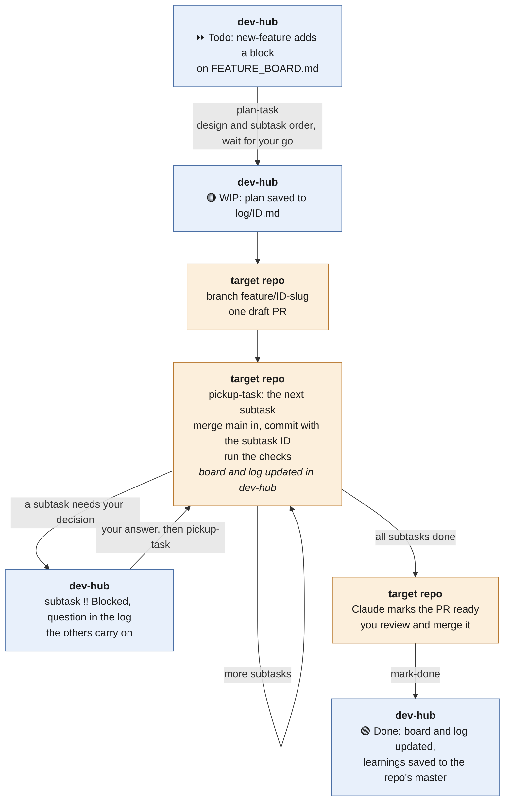
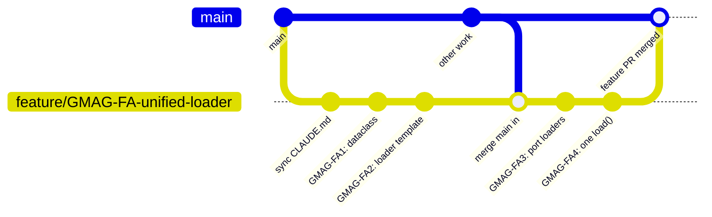

In my [first dev-hub post](https://kylermurphy.github.io/posts/2026/09/post-10/), every piece of work was a **task**: one self-contained change on its own branch, with its own pull request that I merge as soon as it's done. That covers most upkeep. That's generally my workflow, but not everyone's, and some work shouldn't reach `main` one piece at a time: a new module isn't always useful until it's complete and some works needs validating before it replaces the old path.

For that, dev-hub now has **features**: larger work in one repo that lives on a single branch. The work is built one subtask at a time or via a larger plan, and lands in one PR at the end.
{: .notice--primary}

This post covers when to use a feature, what one looks like on the board, and how it runs. *Going further* has the details for when plans change.



## Task or feature?

|  | Task | Feature |
| --- | --- | --- |
| Size | one change | several related steps, days to weeks |
| Branch | `task/<ID>-<slug>` | `feature/<ID>-<slug>`, kept until the feature is finished |
| Pull requests | one per task | one for the whole feature |
| Reaches `main` | when I merge it | all together, at the end |
| Record | a log and a task-log row per task | one log and one row for the feature |
| Board | `TASK_BOARD.md` | `FEATURE_BOARD.md` |

**Use a feature** when there are potentially breaking changes, you're testing large changes (e.g., new algorithms) or there are a number of steps that belong together and `main` shouldn't get them one at a time (e.g., building a new submodule). **Stay with tasks** when each step is useful on its own. Merging as you go keeps reviews small, and long-lived branches drift, so when in doubt use tasks. (For several small, unrelated fixes in one repo, a batch with `multi-task` gives one PR without a long-lived branch.)

## What a feature looks like

Features live on their own board, `FEATURE_BOARD.md`, grouped by repo like the task board. Here's an example for [gmag](https://github.com/kylermurphy/gmag), my ground-magnetometer data package:

### GMAG-FA — One loader for every array: a station-data dataclass and a common loader template
{: .no_toc}

**Status** ⏩ Todo · **Branch** — · **PR** — · **Log** —

**Description.** gmag reads four magnetometer arrays (CANOPUS, CARISMA, IMAGE and THEMIS), each through its own module with its own `list_files`, `download`, `load`, `clean` and `rotate`. This feature adds a dataclass for station data, a common loader template that every array implements, and a single loader that reads data from any array or station into that dataclass. The pieces change the same loading API, so they stay on one branch and reach `main` together.

**Done when.** Every subtask is done: a station-data dataclass holds the field data and the station's metadata; each array's loader implements the common template; one `load()` reads any array or station into the dataclass; the existing per-array `load` functions still work; the loaders are covered by tests; and the README documents the new API.

| ID | Status | Subtask | Effort |
| --- | --- | --- | --- |
| GMAG-FA1 | ⏩ Todo | Add a station-data dataclass for the field data and the station's metadata | M |
| GMAG-FA2 | ⏩ Todo | A common loader template that every array implements (`list_files`, `download`, `load`, `clean`, `rotate`) | M |
| GMAG-FA3 | ⏩ Todo | Port the CANOPUS, CARISMA, IMAGE and THEMIS loaders to the template | L |
| GMAG-FA4 | ⏩ Todo | One `load()` for any array or station, returning the dataclass | M |
| GMAG-FA5 | ⏩ Todo | Document the new loading API in the README | S |

The parts of a block:

- **IDs.** The feature is the repo's prefix plus `F` and a letter (`GMAG-FA`, then `GMAG-FB`). Its subtasks add a number (`GMAG-FA1`, `GMAG-FA2`). Neither can be mistaken for a task ID like `GMAG-2`.
- **The description** is written for someone who has never seen the repo, because that's who reads it: a fresh Claude session. It says what the feature builds and why it's one branch.
- **Done when** is the feature's definition of done. Each subtask has its own as well.
- **Subtasks** should each be small or medium. GMAG-FA3 is large, four loaders in one, so it gets split when the feature is planned, likely into one subtask per array.

## How a feature runs

Features use the same commands as tasks, a little differently:

Blue steps happen in dev-hub (the board, the log and the repo's instructions); orange steps happen in the target repo (the branch and the PR).

1. **Add it:** `new-feature gmag`, then describe the feature. Claude writes the block with the next free letter and proposes the subtasks for me to adjust.
2. **Plan it:** `plan-task GMAG-FA`. Claude reads the block, clones the repo, and proposes a design and an order for the subtasks, splitting any large ones. It waits for my go: features always go through `plan-task`, never `run-task`. Then it saves the plan to `log/GMAG-FA.md`, creates the `feature/GMAG-FA-…` branch and opens **one draft PR** straight away.
3. **Work the subtasks:** `pickup-task GMAG-FA` for the next one, or `pickup-task GMAG-FA3` for a particular one. For each subtask, Claude merges `main` into the branch first, commits with the subtask ID in the message (`GMAG-FA3: …`), runs the checks, and ticks the subtask off on the board and in the log. Any session, on any surface that can push, picks up where the last one stopped.
4. **Review and land:** when every subtask is done, Claude marks the PR ready. I review it as a whole or commit by commit, merge it, and run `mark-done GMAG-FA`. Like a task, that saves anything the work learned into gmag's instructions for next time.

## The feature branch

This is what makes a feature different: one branch that lives for the whole feature.

- `main` is merged in before each subtask, so the branch never drifts far.
- The draft PR is open from the start, so CI runs on every push and I can watch the combined diff grow.
- Nothing reaches `main` until I merge that one PR.

## Where features run

A feature needs a session that can push: Claude Code on a computer, or Claude Code on the web or in the Claude app. [Handback mode](https://kylermurphy.github.io/posts/2026/09/post-11/) (a claude.ai Project) doesn't run them. The branch needs `main` merged in again and again, which a patch can't carry, and handback only returns finished work, which a single subtask never is.

## Try it

The public [dev-hub-template](https://github.com/kylermurphy/dev-hub-template) has the feature board, a [feature guide](https://github.com/kylermurphy/dev-hub-template/blob/main/docs/FEATURES.md) and a filled-in [example feature](https://github.com/kylermurphy/dev-hub-template/blob/main/examples/FEATURE_BOARD.example.md) on an imaginary repo.

## Going further (optional)

### When plans change

- **A subtask needs my decision:** it's marked `‼️ Blocked` in the table, with the question in the feature's log, and the other subtasks carry on.
- **The whole feature stops**, for usage limits say: it's `🛑 Usage-stopped`, like a task, and `pickup-task` resumes it from the log.
- **New work turns up:** I add a subtask row with the next number. No command needed.
- **A subtask isn't needed after all:** its row is removed and the reason goes in the log. Its ID isn't reused.

### Moving tasks into a feature

`new-feature` can also move `Todo` tasks into a feature. gmag's task board already has two that touch the loaders: a test suite for them (GMAG-3) and swapping `wget` for `requests` (GMAG-4). They could join GMAG-FA as subtasks: each keeps its text plus "(was GMAG-3)", its row leaves the task board, and a note there maps the old IDs to the new ones.

### One record per feature

A feature is logged like a single task: one log file, `log/GMAG-FA.md`, with a checklist item per subtask, and one row in the task log. The subtasks don't get logs of their own. At `mark-done`, the feature's learnings go into the same repo instructions as the tasks' do, so the next task or feature in gmag starts with them.

