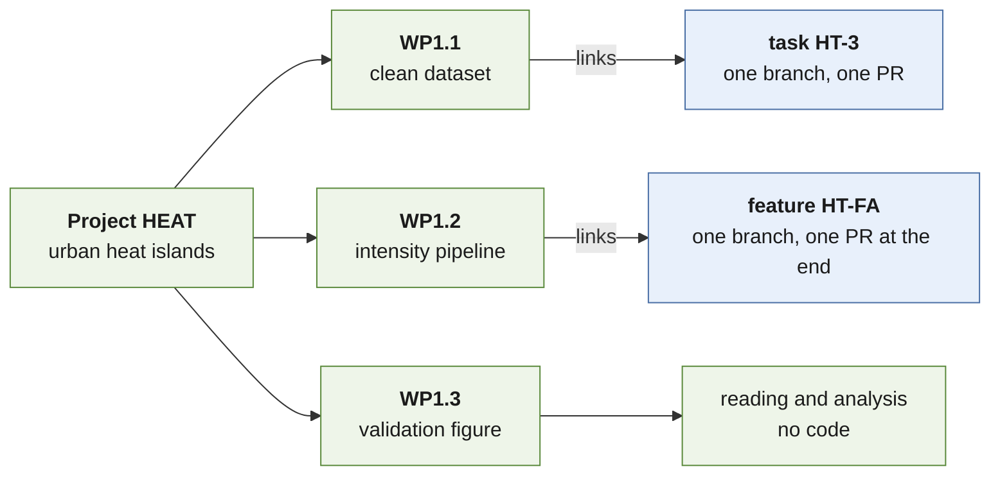

dev-hub started as a way to keep my code in shape: a [task board](https://kylermurphy.github.io/posts/2026/09/post-10/) of small upkeep jobs, and [features](https://kylermurphy.github.io/posts/2026/09/post-12/) for bigger pieces of work. But most of my repos exist because of research, and the reason for any piece of code exists is usually because it's linked to a research project, not on a board.

So dev-hub now has a layer above the boards: **projects**. A project is one Markdown file per research project, holding its goals, objectives, plans, todos, references and a research log, laid out so Claude can read it and plan from it.
{: .notice--primary}

This post uses a made-up project to show how it works. Real project files stay private: the public template ships only the empty project template and this example.



## Three levels of work

| Level | Answers | Horizon | Lives in |
| --- | --- | --- | --- |
| **Project** | *why*: the question, and what counts as success | months | `projects/<name>.md` |
| **Feature** | *what* code gets built as a whole | days to weeks | `FEATURE_BOARD.md` |
| **Task** | *how*: one change at a time | about a session | `TASK_BOARD.md` |

A project breaks into **work packages**, and each work package links down to the tasks and features doing its code work, by their board IDs. The boards don't link back up, so there's only one place to keep current: the project. Research that isn't code (reading, analysis, writing) stays in the project as work packages and todos.



The levels work together, but none needs the others. Tasks alone are the simplest way to use dev-hub, and a project with no tracked repos at all is still a useful research notebook.

## A project file

Each project is one file, `projects/<descriptive-name>.md`, named for people. A short uppercase ID in its metadata is how Claude and I refer to it. The made-up example is `urban-heat-islands.md`, ID `HEAT`:

```yaml
---
id: HEAT            # short and unique
title: Urban heat islands from satellite data
status: active      # or idea, paused, done, dropped
started: 2026-09
horizon: 2027-06    # target end or next milestone
repos: [heat_tools] # tracked repos it uses, or []
updated: 2026-09-29 # changes on every edit
---
```

Then come the same sections every time, in the same order:

| Section | What goes in it |
| --- | --- |
| **Summary** | 2–3 sentences: the question, why it matters, and what success looks like. |
| **Background** | Context, prior work, the open problem, the data and tools. |
| **Science goals** | The long-term questions, `G1`, `G2`, … I set these; Claude doesn't change them. |
| **Objectives and work packages** | One subheading per objective, with its success criteria and a work-package table. |
| **Plans** | Research plans from `plan-project`, newest first, each agreed with me. |
| **Next actions** | The project's todos, as a checklist. |
| **References** | A numbered list with DOI links. |
| **Decisions** | Date, decision and why. |
| **Research log** | Dated bullets, newest first: what happened, and what I learned. |

A work-package table looks like this:

<div class="notice--info" markdown="1">

### O1 — Map summer heat-island intensity for 20 cities, 2015–2025
{: .no_toc}

**Serves:** G1 · **Success criteria:** intensity maps with uncertainty for all 20 cities, validated against station data

| WP | Status | Work package | Output | Links |
| --- | --- | --- | --- | --- |
| WP1.1 | 🟢 Done | Download and cloud-mask the LST scenes | clean dataset | HT-3 |
| WP1.2 | 🟠 WIP | Build the intensity pipeline | maps + uncertainty | HT-FA |
| WP1.3 | ⏩ Todo | Validate against weather stations | validation figure | — |

</div>

`HT-3` and `HT-FA` are a task and a feature on the boards of an imaginary `heat_tools` repo. IDs never change and are never reused (goals `G1`, objectives `O1`, work packages `WP1.1`), so "plan WP1.2" always means the same thing.

## Working with a project

| Command | What it does |
| --- | --- |
| `new-project "<title>"` | Starts a file from the template: Claude proposes the ID and file name, fills in the metadata, adds a row to the portfolio (`projects/INDEX.md`), and offers to write the Summary, Background and goals with me. It never invents goals. |
| `plan-project HEAT WP1.2` | Drafts a research plan for a project, an objective or a work package: the steps as a checklist, the data and methods, the risks, and the code work needed. It **waits for my go**, like `plan-task`. The agreed plan goes under Plans, and any code work becomes tasks or features whose IDs go in the work package's Links. |
| `review-projects` | A monthly check-in. It rebuilds the portfolio and flags active projects with no update in 30 days, blocked work packages, todos older than 30 days, and work packages whose code work is done while the package isn't. It proposes updates and I confirm them. |

Day to day there's no command at all. I just say it: "HEAT log: the cloud mask removes 40% of July scenes", "add a HEAT todo: email the station network", or "HEAT decision: use MODIS, not Landsat, for the daily series". Claude files it in the right section and updates the date. I can also edit the file by hand, as long as the structure stays.

## Making a project easy to plan from

- Make each objective **measurable**, with success criteria you could check.
- Give each work package **one output**: a dataset, a figure, an analysis or a paper section.
- Write plans as **checklists with inputs and outputs**, so each step can become a task.
- Keep **DOIs** in the references, so Claude can find the papers.
- Keep the **log** dated and short. Decisions go in Decisions, not the log.

## Try it

The public [dev-hub-template](https://github.com/kylermurphy/dev-hub-template) has the [project template](https://github.com/kylermurphy/dev-hub-template/blob/main/projects/TEMPLATE.md), a [projects guide](https://github.com/kylermurphy/dev-hub-template/blob/main/docs/PROJECTS.md) and the full [made-up HEAT project](https://github.com/kylermurphy/dev-hub-template/blob/main/examples/projects/urban-heat-islands.md).

## Going further (optional)

### Why a fixed structure

<div class="notice" markdown="1">

Every project has the same sections in the same order, with one work-package table per objective. That's what lets Claude plan from a project without guessing where things are, and `check-board`, the script that checks dev-hub on every pull request, checks each project's metadata, sections, IDs and links, and that the portfolio matches.

</div>

### The goals stay mine

<div class="notice" markdown="1">

Claude proposes; I decide the goals and objectives. It never adds, removes or rewords them without asking. Plans come from `plan-project`, which, like `plan-task`, discusses the plan and waits for my go before anything is saved.

</div>

### Where project edits go

<div class="notice" markdown="1">

Projects aren't tasks: they have no branch, no log and no board status. The file is its own record, and edits go straight to dev-hub's `main`. In a session that can only push to one branch, they go to that branch and a pull request instead, and in [handback mode](https://kylermurphy.github.io/posts/2026/09/post-11/) they come back as a dev-hub patch to apply.

</div>
